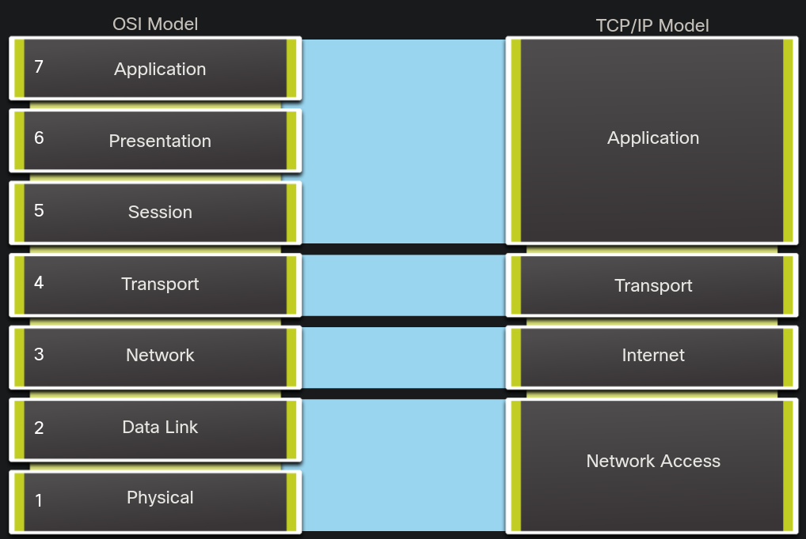

## top-4 commands

1) show the running config
```
Sw-Floor-1# show running-config
```

2) banner motd
```
Sw-Floor-1# configure terminal
Sw-Floor-1(config)# banner motd #Authorized Access Only#
```

3) show ip interfaces 
```
show ip interface brief
```

4) hostname
```
Switch# configure terminal
Switch(config)# hostname Sw-Floor-1
Sw-Floor-1(config)#
```

* starts with a letter
* contain no spaces
* end with a letter or digit
* use only letters, digits, and dashes
* be less than 64 characters in length


## passwords

1) secure user EXEC mode access
```
Sw-Floor-1# configure terminal
Sw-Floor-1(config)# line console 0
Sw-Floor-1(config-line)# password cisco
Sw-Floor-1(config-line)# login
Sw-Floor-1(config-line)# end
Sw-Floor-1#
```

2) secure privileged EXEC access
```
Sw-Floor-1# configure terminal
Sw-Floor-1(config)# enable secret class
Sw-Floor-1(config)# exit
Sw-Floor-1#
```

3) secure VTY lines
```
Sw-Floor-1# configure terminal
Sw-Floor-1(config)# line vty 0 15
Sw-Floor-1(config-line)# password cisco
Sw-Floor-1(config-line)# login
Sw-Floor-1(config-line)# end
Sw-Floor-1#
```

4) encrypt all plaintext passwords
```
Sw-Floor-1# configure terminal
Sw-Floor-1(config)# service password-encryption
Sw-Floor-1(config)#
```

## configurations

1) write config
```
write memory
```

or

```
copy running-config startup-config
```

2) reboot the device (without saving conf)
```
reload
```

3) erase config
```
erase startup-config
```

4) show what's in a directory (i.e. nvram)
```
dir nvram
```

## ip addresses

ipv4 -> 32bits -> the structure of an IPv4 address is called dotted decimal notation
ipv6 -> 128bits

media factors :
* Distance
* Environment
* Amount
* Cost

SVI (switch virtual interface) does not have a physical port associated. default is vlan1

## switch vlan add ip
```
Sw-Floor-1# configure terminal
Sw-Floor-1(config)# interface vlan 1
Sw-Floor-1(config-if)# ip address 192.168.1.20 255.255.255.0
Sw-Floor-1(config-if)# no shutdown
Sw-Floor-1(config-if)# exit
Sw-Floor-1(config)# ip default-gateway 192.168.1.1
```

the default gateway is also configured

## network protocols

1) requirements
    * message encoding
    * message formatting and encapsulation
    * message size
    * message timing
    * message delivery options

2) options
    * unicast
    * multicast
    * broadcast

3) steps
    * encoding      
    process of converting information into another acceptable form, for transmission. Decoding reverses this process to interpret the information.
    * formatting - encapsulation
    when a message is sent from source to destination, it must use a specific format or structure. Message formats depend on the type of message and the channel that is used to deliver the message

## protocol suites

set of protocols that work together to provide comprehensive network communication services

1) network access layer

    Address Resolution

        ARP - Address Resolution Protocol. Provides dynamic address mapping between an IPv4 address and a hardware address.

        Note: You may see other documentation state that ARP operates at the Internet Layer (OSI Layer 3). However, in this course we state that ARP operates at the Network Access layer (OSI Layer 2) because it's primary purpose is the discover the MAC address of the destination. A MAC address is a Layer 2 address.

    Data Link Protocols

        Ethernet - Defines the rules for wiring and signaling standards of the network access layer.
        WLAN - Wireless Local Area Network. Defines the rules for wireless signaling across the 2.4 GHz and 5 GHz radio frequencies.


2) internet layer

    Internet Protocol

        IPv4 - Internet Protocol version 4. Receives message segments from the transport layer, packages messages into packets, and addresses packets for end-to-end delivery over a network. IPv4 uses a 32-bit address.
        IPv6 - IP version 6. Similar to IPv4 but uses a 128-bit address.
        NAT - Network Address Translation. Translates IPv4 addresses from a private network into globally unique public IPv4 addresses.

    Messaging

        ICMPv4 - Internet Control Message Protocol for IPv4. Provides feedback from a destination host to a source host about errors in packet delivery.
        ICMPv6 - ICMP for IPv6. Similar functionality to ICMPv4 but is used for IPv6 packets.
        ICMPv6 ND - ICMPv6 Neighbor Discovery. Includes four protocol messages that are used for address resolution and duplicate address detection.

    Routing Protocols

        OSPF - Open Shortest Path First. Link-state routing protocol that uses a hierarchical design based on areas. OSPF is an open standard interior routing protocol.
        EIGRP - EIGRP - Enhanced Interior Gateway Routing Protocol. An open standard routing protocol developed by Cisco that uses a composite metric based on bandwidth, delay, load and reliability.
        BGP - Border Gateway Protocol. An open standard exterior gateway routing protocol used between Internet Service Providers (ISPs). BGP is also commonly used between ISPs and their large private clients to exchange routing information.


3) transport layer

    Connection-Oriented

        TCP - Transmission Control Protocol. Enables reliable communication between processes running on separate hosts and provides reliable, acknowledged transmissions that confirm successful delivery.

    Connectionless

        UDP - User Datagram Protocol. Enables a process running on one host to send packets to a process running on another host. However, UDP does not confirm successful datagram transmission.


4) application layer

    Name System

        DNS - Domain Name System. Translates domain names such as cisco.com, into IP addresses.

    Host Config

        DHCPv4 - Dynamic Host Configuration Protocol for IPv4. A DHCPv4 server dynamically assigns IPv4 addressing information to DHCPv4 clients at start-up and allows the addresses to be re-used when no longer needed.
        DHCPv6 - Dynamic Host Configuration Protocol for IPv6. DHCPv6 is similar to DHCPv4. A DHCPv6 server dynamically assigns IPv6 addressing information to DHCPv6 clients at start-up.
        SLAAC - Stateless Address Autoconfiguration. A method that allows a device to obtain its IPv6 addressing information without using a DHCPv6 server.

    Email

        SMTP - Simple Mail Transfer Protocol. Enables clients to send email to a mail server and enables servers to send email to other servers.
        POP3 - Post Office Protocol version 3. Enables clients to retrieve email from a mail server and download the email to the client's local mail application.
        IMAP - Internet Message Access Protocol. Enables clients to access email stored on a mail server as well as maintaining email on the server.

    File Transfer

        FTP - File Transfer Protocol. Sets the rules that enable a user on one host to access and transfer files to and from another host over a network. FTP is a reliable, connection-oriented, and acknowledged file delivery protocol.
        SFTP - SSH File Transfer Protocol. As an extension to Secure Shell (SSH) protocol, SFTP can be used to establish a secure file transfer session in which the file transfer is encrypted. SSH is a method for secure remote login that is typically used for accessing the command line of a device.
        TFTP - Trivial File Transfer Protocol. A simple, connectionless file transfer protocol with best-effort, unacknowledged file delivery. It uses less overhead than FTP.

    Web and Web Service

        HTTP - Hypertext Transfer Protocol. A set of rules for exchanging text, graphic images, sound, video, and other multimedia files on the World Wide Web.
        HTTPS - HTTP Secure. A secure form of HTTP that encrypts the data that is exchanged over the World Wide Web.
        REST - Representational State Transfer. A web service that uses application programming interfaces (APIs) and HTTP requests to create web applications.




## standards
1) organizations       
    * Internet Society (ISOC) - Responsible for promoting the open development and evolution of internet use throughout the world.
    * Internet Architecture Board (IAB) - Responsible for the overall management and development of internet standards.
    * Internet Engineering Task Force (IETF)- Develops, updates, and maintains internet and TCP/IP technologies. This includes the process and documents for developing new protocols and updating existing protocols, which are known as Request for Comments (RFC) documents.
    * Internet Research Task Force (IRTF)- Focused on long-term research related to internet and TCP/IP protocols such as Anti-Spam Research Group (ASRG), Crypto Forum Research Group (CFRG), and Peer-to-Peer Research Group (P2PRG).

    * Internet Corporation for Assigned Names and Numbers (ICANN)- Based in the United States, ICANN coordinates IP address allocation, the management of domain names, and assignment of other information used in TCP/IP protocols.
    * Internet Assigned Numbers Authority (IANA)- Responsible for overseeing and managing IP address allocation, domain name management, and protocol identifiers for ICANN.

    * Institute of Electrical and Electronics Engineers(IEEE, pronounced “I-triple-E”) - Organization of electrical engineering and electronics dedicated to advancing technological innovation and creating standards in a wide area of industries including power and energy, healthcare, telecommunications, and networking. Important IEEE networking standards include 802.3 Ethernet and 802.11 WLAN standard. Search the internet for other IEEE network standards.
    * Electronic Industries Alliance (EIA) - Organization is best known for its standards relating to electrical wiring, connectors, and the 19-inch racks used to mount networking equipment.
    * Telecommunications Industry Association (TIA) - Organization responsible for developing communication standards in a variety of areas including radio equipment, cellular towers, Voice over IP (VoIP) devices, satellite communications, and more.
    * International Telecommunications Union-Telecommunication Standardization Sector (ITU-T) - One of the largest and oldest communication standards organizations. The ITU-T defines standards for video compression, Internet Protocol Television (IPTV), and broadband communications, such as a digital subscriber line (DSL).

## encapsulation

1) segmentation
    * segmentation = cut long messages in pieces
    * multiplexing = not only one restrictive communication, but a lot sending packets processed in queue

2) sequencing   

    in what order to reassemble the packets

3) PDU (protocol data unit)     


    * Data - The general term for the PDU used at the application layer
    * Segment - Transport layer PDU
    * Packet - Network layer PDU
    * Frame - Data Link layer PDU
    * Bits - Physical layer PDU used when physically transmitting data over the medium

## data access

1) layers
    * layer 3  = network layer => source IP to dest IP 
    * layer 2 = data link =>  dest MAC to source MAC


 ## physical layer

1) components
2) encoding     
    method of converting a stream of data bits into a predefined "code"
3) signaling
    generate the electrical, optical, or wireless signals that represent the "1" and "0" on the media
4) bandwidth    
    capacity at which a medium can carry data
    * Latency   
    delay between sending and receiving
    * Throughput
    how much data sent withing a given time
    * Goodput
    usable data transferred over time
5) utp 
    * Category 3 was originally used for voice communication over voice lines, but later used for data transmission. not braided
    * Category 5 and 5e is used for data transmission. Category 5 supports 100Mbps and Category 5e supports 1000 Mbps braided
    * Category 6 has an added separator between each wire pair to support higher speeds. Category 6 supports up to 10 Gbps.
    * Category 7 also supports 10 Gbps.
    * Category 8 supports 40 Gbps.

    

    

6) fiber 
    * single mode   
    lower dispersion, single ray of light, laser
    * multimode     
    higher dispersion, led emitters
    * connectors
        * straight-tip
        * subscriber connector
        * lucent connector
        * duplex multimode lc connector
    * cords
        * sc-sc multimode patch (orange)
        * lc-lc single mode patch (yellow)
        * st-lc multimode patch (orange)
        * sc-st single mode patch (yellow)
7) wireless 
    * properties
        * coverage area
        * interference
        * security
        * shared medium (half duplex)
    * types
        * Wi-Fi (IEEE 802.11)
        * Bluetooth (IEEE 802.15)   up to 100 m ??
        * WiMAX (IEEE 802:16)
        * Zigbee (IEEE 802.15.4)

## number systems


## notes

1) which two functions are provided to users by the context-sensitive help feature of the Cisco IOS CLI? (Choose two.)
    * displaying a list of all available commands within the current mode
    * determining which option, keyword, or argument is available for the entered command

2) com fundamentals
    * message source (sender) - Message sources are people, or electronic devices, that need to send a message to other individuals or devices.
    * message Destination (receiver) - The destination receives the message and interprets it.
    * channel - This consists of the media that provides the pathway over which the message travels from source to destination.

3) MAC 
    * 12 hexadecimal values
    * 48 bits

4) IPv4 
    * 32 bits

5) IPv6
    *128 bits

6) ssh vs telnet
    * ssh : secure
    * telnet : insecure

7) ctrl + shift + 6 
    * interrupt

8) flow control
    * enables connected Ethernet ports to control traffic rates during congestion by allowing congested nodes to pause link operation at the other end.

9) end
    * end = ctrl + z

10) which interface allows remote management of a Layer 2 switch?
    * the switch virtual interface (allows use of ssh/telnet)

11) crosstalk
    * one wire -> interferes with another

12) console cable 
    * console cable = rollover cable